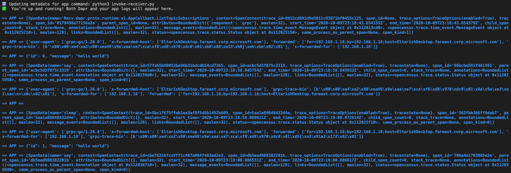
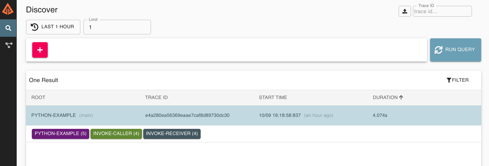
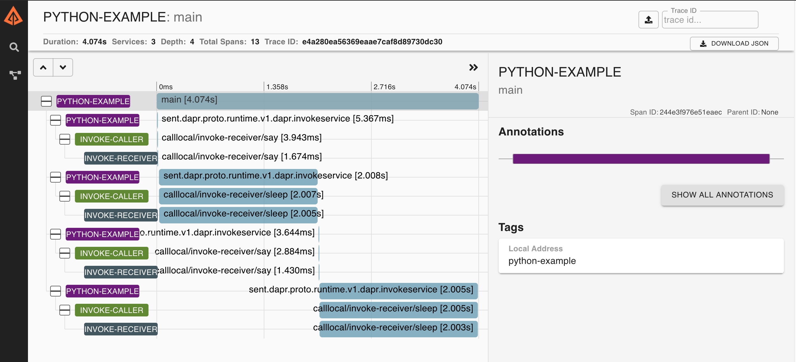

# Example - Distributed tracing

In this sample, we'll run two Python applications: a service application, which exposes two methods, and a client application which will invoke the methods from the service using Dapr. The code is instrumented with [OpenCensus SDK for Python](https://opencensus.io/guides/grpc/python/).
This sample includes:

- invoke-receiver: Exposes the methods to be remotely accessed
- invoke-caller: Invokes the exposed methods

Also consider [getting started with observability in Dapr](https://github.com/dapr/quickstarts/tree/master/observability).
 
## Example overview

This sample uses the Client provided in Dapr's Python SDK invoking a remote method and Zipkin to collect and display tracing data. 

## Pre-requisites

- [Dapr CLI and initialized environment](https://docs.dapr.io/getting-started)
- [Install Python 3.7+](https://www.python.org/downloads/)

### Install dependencies

Clone this repository:

```sh
git clone https://github.com/dapr/python-sdk.git
cd python-sdk
```

Then get into the examples directory:

```sh
cd examples/w3c-tracing
```

Install dependencies:

<!-- STEP
name: Install deps
-->

```sh
pip3 install -r requirements.txt
```

<!-- END_STEP -->

### Verify Zipkin is running

Run `docker ps` to see if the container `dapr_zipkin` is running locally: 

```bash
CONTAINER ID        IMAGE                  COMMAND                  CREATED             STATUS              PORTS                              NAMES
24d043379da2        daprio/dapr            "./placement"            2 days ago          Up 32 hours         0.0.0.0:6050->50005/tcp            dapr_placement
5779a0268159        openzipkin/zipkin      "/busybox/sh run.sh"     2 days ago          Up 32 hours         9410/tcp, 0.0.0.0:9411->9411/tcp   dapr_zipkin
317fef6a8297        redis                  "docker-entrypoint.s…"   2 days ago          Up 32 hours         0.0.0.0:6379->6379/tcp             dapr_redis
```

If Zipkin is not working, [install the newest version of Dapr Cli and initialize it](https://docs.dapr.io/getting-started/install-dapr/).

### Run the Demo service sample

The Demo service application exposes two methods that can be remotely invoked. In this example, the service code has two parts:

In the `invoke-receiver.py` file, you will find the OpenCensus tracing and exporter initialization in addition to two methods: `say` and `sleep`. The instrumentation for the service happens automatically via the `OpenCensusServerInterceptor` class.
```python
tracer_interceptor = server_interceptor.OpenCensusServerInterceptor(AlwaysOnSampler())
app = App(
    thread_pool=futures.ThreadPoolExecutor(max_workers=10),
    interceptors=(tracer_interceptor,))
```


The `say` method prints the incoming payload and metadata in console. See the code snippet below:

```python
@app.method(name='say')
def say(request: InvokeMethodRequest) -> InvokeMethodResponse:
    tracer = Tracer(sampler=AlwaysOnSampler())
    with tracer.span(name='say') as span:
        data = request.text()
        span.add_annotation('Request length', len=len(data))
        print(request.metadata, flush=True)
        print(request.text(), flush=True)

        return InvokeMethodResponse(b'SAY', "text/plain; charset=UTF-8")
```

The `sleep` methods simply waits for two seconds to simulate a slow operation.
```python
@app.method(name='sleep')
def sleep(request: InvokeMethodRequest) -> InvokeMethodResponse:
    tracer = Tracer(sampler=AlwaysOnSampler())
    with tracer.span(name='sleep') as _:
        time.sleep(2)
        print(request.metadata, flush=True)
        print(request.text(), flush=True)

        return InvokeMethodResponse(b'SLEEP', "text/plain; charset=UTF-8")
```

Use the following command to execute the service:

<!-- STEP
name: Run app with tracing
expected_stdout_lines:
  - "✅  You're up and running! Both Dapr and your app logs will appear here."
  - "✅  Exited Dapr successfully"
  - "✅  Exited App successfully"
expected_stderr_lines:
background: true
sleep: 5
-->

```sh
dapr run --app-id invoke-receiver --app-protocol grpc --app-port 3001 python3 invoke-receiver.py
```

<!-- END_STEP -->

Once running, the service is now ready to be invoked by Dapr.


### Run the InvokeClient sample

This sample code uses the Dapr SDK for invoking two remote methods (`say` and `sleep`). Again, it is instrumented with OpenCensus with Zipkin exporter. See the code snippet below:

```python
ze = ZipkinExporter(
    service_name="python-example",
    host_name='localhost',
    port=9411,
    endpoint='/api/v2/spans')

tracer = Tracer(exporter=ze, sampler=AlwaysOnSampler())

with tracer.span(name="main") as span:
    with DaprClient(tracer=tracer) as d:

        num_messages = 2

        for i in range(num_messages):
            # Create a typed message with content type and body
            resp = d.invoke_method(
                'invoke-receiver',
                'say',
                data=json.dumps({
                    'id': i,
                    'message': 'hello world'
                    }),
            )
            # Print the response
            print(resp.content_type, flush=True)
            print(resp.text(), flush=True)

            resp = d.invoke_method('invoke-receiver', 'sleep', data='')
            # Print the response
            print(resp.content_type, flush=True)
            print(resp.text(), flush=True)
```

The class knows the `app-id` for the remote application. It uses `invoke_method` to invoke API calls on the service endpoint. Instrumentation happens automatically in `Dapr` client via the `tracer` argument.
 
Execute the following command in order to run the caller example, it will call each method twice:

<!-- STEP
name: Run caller app with tracing
expected_stdout_lines:
  - "✅  You're up and running! Both Dapr and your app logs will appear here."
  - '== APP == text/plain'
  - '== APP == SAY'
  - '== APP == text/plain'
  - '== APP == SLEEP'
  - '== APP == text/plain'
  - '== APP == SAY'
  - "✅  Exited App successfully"
expected_stderr_lines:
background: true
sleep: 10
-->

```bash
dapr run --app-id invoke-caller --app-protocol grpc python3 invoke-caller.py
```

<!-- END_STEP -->

<!-- STEP
name: Pause for manual validation
manual_pause_message: "Zipkin tracing running on http://localhost:9411. Please open in your browser and test manually."
-->

<!-- END_STEP -->

Once running, the output should display the messages sent from invoker in the service output as follows:



Methods have been remotely invoked and display the remote messages.

Now, open Zipkin on [http://localhost:9411/zipkin](http://localhost:9411/zipkin). You should see a screen like the one below:


Click on the search icon to see the latest query results. You should see a tracing diagram similar to the one below:



Once you click on the tracing event, you will see the details of the call stack starting in the client and then showing the service API calls right below.



### Zipkin API

Zipkin also has an API available. See [Zipkin API](https://zipkin.io/zipkin-api/) for more details.

To see traces collected through the API:

<!-- STEP
expected_stdout_lines:
  - '"calllocal/invoke-receiver/say"'
  - '"calllocal/invoke-receiver/sleep"'
  - '"calllocal/invoke-receiver/say"'
  - '"calllocal/invoke-receiver/sleep"'
expected_stderr_lines:
name: Curl validate
-->

```bash
curl -s "http://localhost:9411/api/v2/traces?serviceName=invoke-receiver&spanName=calllocal%2Finvoke-receiver%2Fsay&limit=10" -H  "accept: application/json" | jq ".[][] | .name, .duration"
```

<!-- END_STEP -->

The `jq` command line utility is used in the above to give you a nice human readable printout of method calls and their duration:

```
"calllocal/invoke-receiver/say"
12711
"calllocal/invoke-receiver/say"
15218
"calllocal/invoke-receiver/sleep"
2005904
"calllocal/invoke-receiver/say"
1407
"calllocal/invoke-receiver/sleep"
2006538
"calllocal/invoke-receiver/say"
1844
"main"
4045202
"calllocal/invoke-receiver/sleep"
2004350
"calllocal/invoke-receiver/sleep"
2004914
```

## Cleanup

Shutdown running dapr apps with Ctl-C or simply run the following:

<!-- STEP
expected_stdout_lines: 
  - '✅  app stopped successfully: invoke-receiver'
expected_stderr_lines:
name: Shutdown dapr
-->

```bash
dapr stop --app-id invoke-caller
dapr stop --app-id invoke-receiver
```

<!-- END_STEP -->


